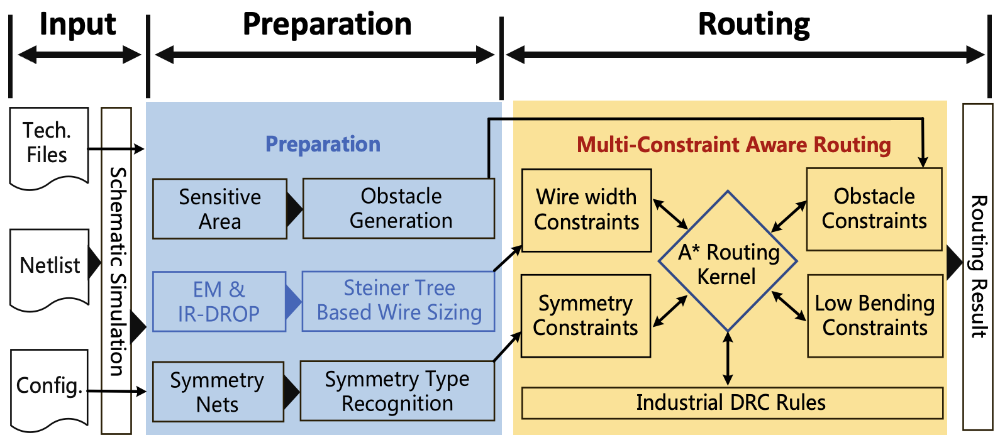
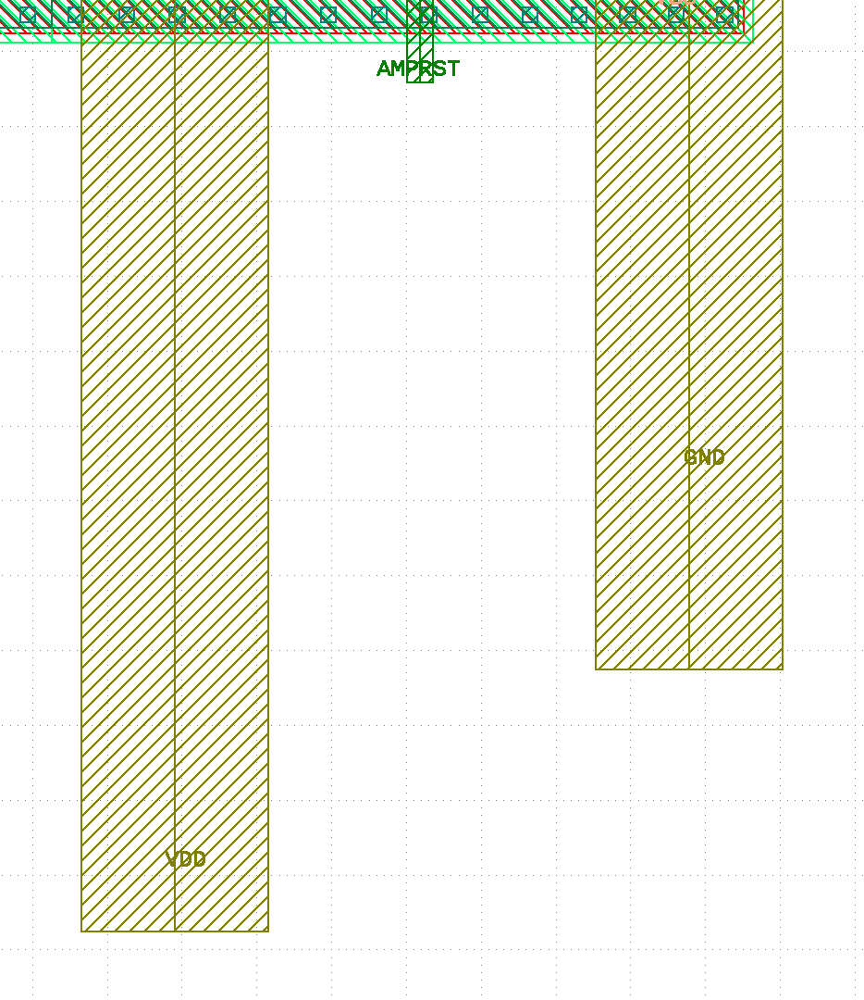

# SAGERoute1.0.0: Synergistic Analog Routing Considering Geometric and Electrical Constraints with Manual Design Compatibility

## Overview
SAGERoute takes circuit netlist, technology file and user defined config as input to generate the high-quality solution for analog circuit. 



## Introduction of the input
```
techfile:    Basic information of technology lib. Here we release a mock PDK for your test
paramfile:   Some parameters for user to directly control the routing kernel 
netlist:     A formal netlist generated from CDF file
placement:   Here we only release the placement generated by automatic tools(coord only format). The manual placement(gds format) can't be realeased due to the NDA
constraints: The electric current information of the circuit
result:      You could save the gds result here
```
## Compilation Platform
```
Operating system:  Ubuntu 18.04 
GCC version:  7.5.0
Runtime dependency: Lpsolve5.5 (liblpsolve55.so), libz.so, libm.so, libc.so, libdl.so
```

## Test 
```
To use netlist and placement as input you should use the following command
./sageroute \ 
--techfile="../benchmark/mockPDK/lef.json"  \
--paramfile="../benchmark/ota2/config.json" \ 
--netlist="../benchmark/ota2/ota2.sp"       \
--placement="../benchmark/ota2/ota2.json"   \
--constraints="../benchmark/ota2/elec.json" \
--result="../benchmark/ota2/ota2.gds"         

To use the taged manual placement(Gds type) ,you should use the following commad:
./sageroute --techfile="" --paramfile="" --placement_gds="" --constraints=""(optional) --result=""

```

## Tag Gds Prepare
```
If you want to use the routing with the manual gds input, please prepare the gds according to the following steps:
1. TAG all of the pins with correct net name, note that the router will connect the pins with the same net name. (TAG is on the Metal layer not the pin layer)
2. Select correct routing layer in config.json
3. set the bLayoutparse to true.
Here is an example of a taged gds: 
```




## Citation

```
@inproceedings{zhang2023sageroute,
    author = {Zhang, Haoyi and Gao, Xiaohan and Luo, Haoyang and Song, Jiahao and Liu, Junhua and Tang, Xiyuan and Lin, Yibo and Wang, Runsheng and Huang, Ru},
    title = {SAGERoute: Synergistic Analog Routing Considering Geometric and Electrical Constraints with Manual Design Compatibility},
    booktitle = {IEEE/ACM Proceedings Design, Automation and Test in Eurpoe (DATE)},
    year = {2023},
    numpages = {6},
    location = {Antwerp, Belgium},
}
```

## Contact

For any questions, please do not hesitate to contact us or raise [issues on Github](https://github.com/PKU-IDEA/SAGERoute/issues).

```
Haoyi Zhang: hy.zhang@stu.pku.edu.cn
```
